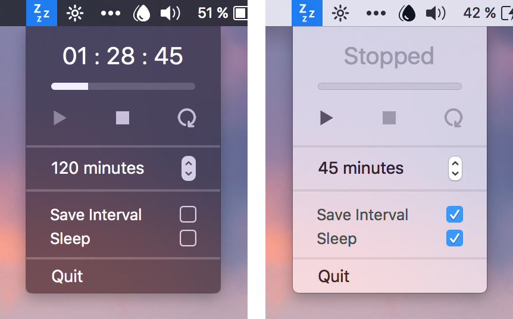

# SleepWell
A macOS menu bar application that lets you schedule the shutdown of your computer.

&nbsp;

## Preamble
I'm one of those people that always fall asleep watching a movie, a TV series or whatever else interesting I might find on YouTube, but often I'd fall asleep without shutting down my computer. This is obviously not ideal, and for a while I used the lovely [GoodNight.app](http://goodnight.jakobbossek.de/) by [Jakob Bossek](http://www.jakobbossek.de/), but this app has now been rendered obsolete with macOS Sierra (at least for the timebeing).

Enter, `SleepWell.app`. It pretty much does what `GoodNight.app` did, but with my own GUI. Please also keep in mind that this is the very first time I've used Swift, and performance and/or beautiful code wasn't my initial goal, but rather, a functional app. Cleanup may very well follow some day.

&nbsp;

## Prerequisites
+ macOS 10.12+
+ **[SleepWell.app.zip](https://github.com/eklundchristopher/SleepWell/releases)**

&nbsp;

## Usage
### Timer & Progressbar
Pretty self-explantory, I feel. Assuming the timer has begun, it displays the amount of time that remains before the computer shuts down (or goes to sleep) — as well as a visual progressbar.

### Controls
#### &#9654; Play Button
Starts the timer at the specified time interval.

#### &#9726; Stop Button
Stops the timer.

#### &#10226; Restart Button
Restarts the timer at the specified time interval.

### Time Interval
Set the time interval for the timer. It defaults to 120 minutes and increases or decreases by 5 minutes as you click on the stepper control. The allowed range is between 5 to 600 minutes.

> If you adjust the time interval value while a timer is going on, it will immediately restart the timer at your new time interval.

### Preference: Save Interval
With this option enabled, every time you change the time interval, it will save the value permanently. So the next time you open the application, the time interval will be as you last had it.

> You may change the default Time Interval by ticking the `Save Interval` preference, changing the time interval stepper to your desired default value, and then unticking the `Save Interval` preference again.

### Preference: Sleep
If you'd rather have your computer go to sleep as opposed to shutting down, you should enable this option.

&nbsp;

## (Optional) Force-disable "Reopen windows when logging back in"
`SleepWell.app` utilises AppleScript to shutdown the computer without forcing the user to provide their login password. Unfortunately, this method also seems to ignore the "Reopen windows when logging back in" option set when you shutdown your computer normally.

If you're anything like me, having all the applications reopen on the next boot will drive you insane... Fret not! You may follow [these instructions](https://techblog.willshouse.com/2012/01/15/disable-reopen-windows-when-logging-back-in-by-default-os-x-lion/) to force-disable this behaviour.

> Please note that these instructions are completely independent to `SleepWell.app`.

&nbsp;

## Contribution
As mentioned in the preamble, this is my very first experience with Swift, and I would gladly accept contributions that introduce new features or generally improve the codebase.
